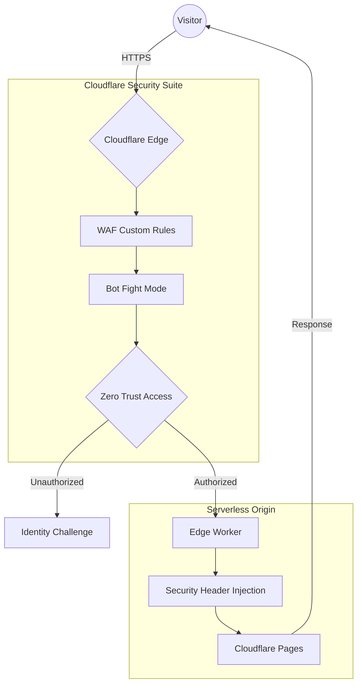

# 🔐 Cloudflare Zero Trust Edge Security Stack

**Author:** Alex Sanchez  
**Domain:** `alexsanchez.site`

---

> **TL;DR**  
> This repository documents a **production-style Zero Trust security architecture** built entirely on Cloudflare’s edge.  
> All access is identity-aware: **no identity, no access**.

---

## 🧠 Project Overview

This project uses **Cloudflare as a global security control plane** to protect both:

- A **public-facing site**
- A **Zero Trust–protected internal dashboard**

Security enforcement happens **before application code executes**, using:
- Identity-aware access (Zero Trust)
- Web Application Firewall (WAF)
- Bot & threat intelligence mitigation
- Edge-executed logic via Cloudflare Workers

🎯 **Goal:** Demonstrate real-world security engineering, not just configuration.

---

## 🏗️ High-Level Architecture

> All traffic enters through Cloudflare's Anycast network, where security is enforced *before* reaching the application.

📌 **No origin servers are exposed**, significantly reducing attack surface.

---

## 📦 Repository Purpose

This repository represents the **security control plane** of the system.

| Component | Purpose |
|---------|---------|
| Cloudflare Worker | Edge security logic & header enforcement |
| Documentation | Architecture, controls, validation |
| Metadata API | Proof of edge execution |

🧩 Other repositories (public site & secure dashboard) are **applications protected by this stack**.

---

## 🔑 Core Security Layers

### 🛂 Zero Trust & Identity
- Cloudflare Access enforcing **identity-aware access**
- GitHub OAuth authentication (any authenticated account)
- One-Time Pin (OTP) authentication for guest access
- **Anonymous access fully blocked**
- JWT propagation validated in the protected dashboard

---

### ⚙️ Edge Security Logic (Cloudflare Workers)
- Globally deployed Cloudflare Worker
- Dynamic injection of security headers:
  - `Strict-Transport-Security`
  - `Content-Security-Policy`
  - `X-Frame-Options`
  - `Permissions-Policy`
- Custom edge endpoint:
  - `/?metadata=true` → live request metadata (IP, country, Ray ID)
- Strict CORS enforcement between public and secure subdomains

---

### 🛡️ WAF & Threat Mitigation
- Custom WAF rules protecting against:
  - XSS & SQL injection patterns
  - Sensitive path scanning (`.env`, `/wp-admin`)
  - Automated bots & scrapers
  - Abuse & rate-based attacks
  - High-risk IPs (threat score intelligence)
- Scrape Shield (email obfuscation)
- Page Shield (third-party script monitoring)
- Global security level set to **High**

---

### ☁️ Serverless Architecture
- Cloudflare Pages for static hosting
- No backend servers
- No exposed APIs
- Security enforced **before** application logic

---

## 🔬 Security Validation

> This project does not assume security — it **verifies it**.

All security controls were tested using **controlled, non-destructive attack simulations** against infrastructure owned by the author.

Validated areas include:
- Zero Trust authentication enforcement (GitHub OAuth & OTP)
- WAF rule effectiveness
- Bot mitigation behavior
- Edge security header enforcement
- Threat intelligence challenges

📄 **Full testing methodology & results:**  
➡️ `docs/Security Validation & Attack Mitigation.md`

---

## 📚 Documentation Structure

This repository follows a **security-first documentation model**:

| Document | Purpose |
|--------|--------|
| `README.md` | High-level overview (this file) |
| `docs/architecture.md` | Traffic flow & system design |
| `docs/security-controls.md` | Defensive controls & rationale |
| `docs/Security Validation & Attack Mitigation.md` | Proof controls work |
| `docs/threat-model.md` | Risk assumptions *(optional)* |

---

## 🎯 What This Project Demonstrates

✅ Zero Trust architecture  
✅ Identity-aware access control  
✅ Edge-based security enforcement  
✅ WAF rule design & threat modeling  
✅ Bot & abuse mitigation  
✅ Security validation & documentation  
✅ Production-style repo organization  

---

## ⚠️ Ethical Notice

All testing documented in this project was:
- Performed only on systems owned by the author
- Non-destructive
- Intended solely to validate defensive security controls

---

> **This repository documents a security system — not just an application.**
